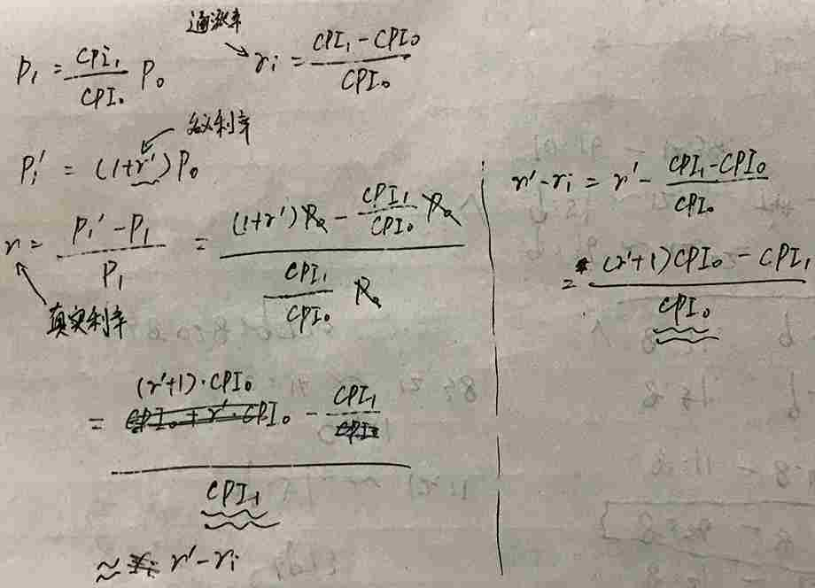

# 宏观经济学

## 第23章：一国收入的衡量

Q: GDP的定义是什么，有哪些组成部分？

GDP衡量一个国家在一定时期内所产出的最终产品的总价值，该定义强调GDP对“支出”的衡量。

GDP包含：C（消费），I（投资），G（政府购买），NX（净出口）

Q: 名义GDP、真实GDP和GDP平减指数分别是什么？

**名义GDP**:以当年的物价衡量出的生产总值。

**真实GDP**：以基年的物价衡量出的生产总值，它强调对“产量”的衡量。

**GDP平减指数**：[名义GDP / 真实GDP] * 100，它强调对“物价变动”的衡量。

## 第24章：生活费用的衡量

Q: 描述一下CPI计算的4个步骤？

1. 确定一篮子物品组成，和每样物品所对应的权重。
1. 找出每样物品在当年的价格。
1. 将每样物品的价格和物品的权重相乘，然后累加，得出总价。
1. 选择某一年作为基年，则当年CPI = 当年一篮子物品的总价 / 基年一篮子物品的总价。

Q: 根据CPI如何计算通货膨胀率？

通货膨胀率 = [(当年CPI - 去年CPI) / 去年CPI] * 100

Q: 如何校正通货膨胀对经济变量的影响？

如果我们知道今年的CPI和过去某年的CPI，由于

**今年1元的购买力/过去某年1元的购买力 = 今年CPI/过去某年CPI**

所以**过去某年1元的购买力 相当于 今年1元的购买力*过去某年CPI/今年CPI**。

举例：过去某年CPI=10，今年CPI=50，则过去某年1元的购买力相当于今天的**1*10/50 = 0.2**元的购买力，货币贬值了8成。

Q: 名义利率、真实利率分别衡量什么？

**名义利率**衡量货币数量的变化速度。

**真实利率**是对名义利率进行通货膨胀校正后得出的，衡量货币购买力的变化速度。

真实利率≈名义利率-通货膨胀率。

下图做了一个推导。虚线左侧是真实利率的计算公式，右侧是名义利率-通货膨胀率，可以看出它们的差别在于分母不同。

比如，假设去年CPI是100，今年CPI是110，名义利率是5%。

去年存入100元，今年可以得到105元。

但由于通货膨胀，去年100元的购买力相当于今年的110元，换句话说，去年用100元能买到的东西，今年用100元买不到了，需要用110元才能买到。

所以真实利率 = (105-110)/110 ≈ -5%。

## 第25章：生产与增长

Q: 生活水平的高低取决于什么？

举个例子：鲁宾逊流落荒岛，依靠打渔为生，在一段时间内，他打到的鱼越多，生活水平越好。

决定他的打渔效率的要素可以归纳为4点：

1. **物质资本(K)**：他有多少只鱼竿、多少分量的鱼饵以及多少只渔网。
1. **人力资本(H)**：他对鱼竿、渔网的使用技能的掌握程度。
1. **自然资源(N)**：荒岛上鱼的数量，鱼类数量富饶他就更可能捕获更多的鱼。
1. **技术知识(A)**：他如果发明出更好的打渔技术和工具，他也就能捕获更多的鱼。

当然，对一个经济体来说，决定生活水平（即产量）的除了以上4点，还包括**劳动力的数量(L)**，即**产量(Y)**=AF(L,K,H,N)。

其中F()是生产函数。许多F具有**规模收益不变**的特性：xY=AF(xL,xK,xH,xN)，即如果所有投入都变为x倍，产量也变为原来的x倍。

还有一种含义：Y/L = AF(1, K/L, H/L, N/L)，其中 Y/L 是每个工人的产量，取决于每个工人所投入的物质资本、人力资本和自然资源。

Q: 什么样的政策可以提高生产力？

1. **储蓄**可以刺激投资，进而增加未来的资本存量。注意收益递减和追赶效应。
1. **外国投资**
1. **教育、营养**
1. **稳定的政治环境和产权制度**
1. **自由贸易**
1. **研究与开发**
1. **人口增长**。虽然大量的人口会稀释资本存量，但其也能促进技术进步。

## 第26章：储蓄、投资和金融体系

Q: 解释一下名词：金融体系、金融机构

**金融体系**：促使一个人的储蓄和另一个人的投资相匹配的各个金融机构。

**金融机构**可分为两大类：金融市场和金融中介机构。

**金融市场**主要是股票和债权市场。

**金融中介机构**主要有银行、共同基金。

Q: 在封闭的经济中，国民储蓄（总储蓄）和总投资是什么关系？国民储蓄包含哪些部分？

回顾GDP的组成：Y=C+I+G+NX.

在封闭的经济中，NX=0，Y=C+I+G。

可推导出：Y-C-G=I，等式左边记作S（国民储蓄），也就是S=I。

再来考虑S=Y-C-G。定义一个变量（T），表示政府从人们手中收的税，减去政府返还给人们的钱（福利等）之后所剩下的余额，那么：

S=(Y-T-C) + (T-G)。第一个括号是**私人储蓄**，第二个括号是**公共储蓄**。

公共储蓄为正表示政府**预算盈余**，为负表示**预算赤字**。

Q: **可贷资金**表示人们的储蓄以及投资者贷来的款项。可贷资金的供求关系是怎样的？

关键因素：**利率**。

利率升高，可贷资金的供给增加，需求减少，反之亦然。

Q: 储蓄激励如何影响可贷资金的供求关系？

xxx

Q: 投资激励如何影响可贷资金的供求关系？

xxx

Q: 政府预算赤字如何影响可贷资金的供求关系？

xxx

## 来自时事

Q: 为什么俄乌形势会导致A股下跌，石油为什么逆势走强？

导致A股下跌的原因是多方面的，而石油、黄金等由于是“安全的资产”，当人们持有悲观预期时倾向于持有此类资产，因此价格上升。